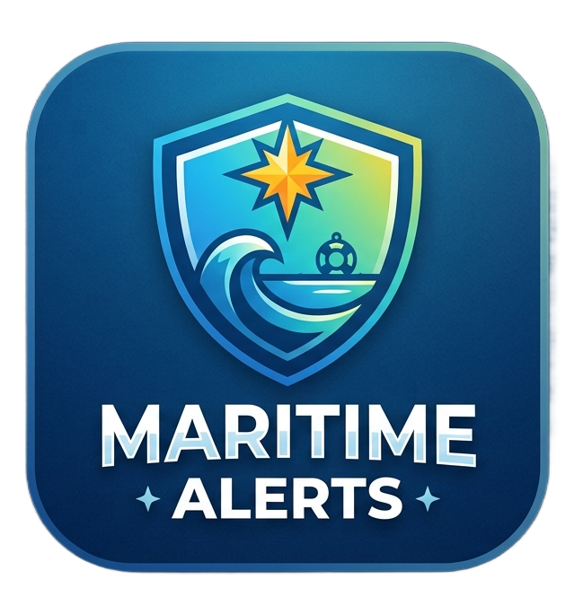

# 🛡️ Maritime Alerts — Live Emergency & Incident Map



**Maritime Alerts** is a full-stack, containerized web application that aggregates live emergency incident dispatches, 511 highway traffic closures, power outage alerts, police advisories, and daily provincial burn restrictions across Nova Scotia and the Maritimes, geocodes call locations, and plots them onto an interactive live map.

---

## ✨ Key Features

* 🗺️ **Interactive Live Incident Map**: Built with [Leaflet.js](https://leafletjs.com/) and CartoDB Dark Matter tiles, centered on Halifax (`[44.6488, -63.5752]`) with Maritime-wide controls.
* 📍 **Region Switcher**: Toggle viewports and dispatches between:
  * **Halifax (HRM)**
  * **Cape Breton (CBRM & Island)**
  * **Annapolis Valley** (Hants, Kings, Annapolis, Digby)
  * **South Shore** (Lunenburg, Queens, Shelburne, Yarmouth)
  * **North Shore** (Colchester, Pictou, Cumberland, Antigonish)
  * **All Maritimes** (Full provincial overview)
* 🏷️ **Category Filter Pills**: Interactive filter buttons with glowing active states for:
  * 🔴 **Structure Fire**
  * 🚙 **511 Traffic / Hwy Incidents**
  * ⚡ **Power Outages**
  * 🔵 **Medical Assistance**
  * 🟠 **Rescue / Motor Vehicle Collisions**
  * 🟣 **Alarm Activations**
  * 🟢 **Outside / Brush Fires**
  * 🩷 **Hazmat & Gas Leaks**
  * 🩶 **Police Alerts**
* 🔄 **Bi-Directional Map & Feed Sync**: Clicking a sidebar dispatch card flies the map to the incident location and opens its popup. Clicking a map marker highlights and scrolls to the card in the sidebar.
* 🔥 **BurnSafe Status**: Live indicator for county-level open-fire burn restrictions.
* 📱 **Mobile PWA Ready**: Installable directly onto iOS and Android home screens as a standalone web app.

---

## 🚀 Quick Start Guide

### Option 1: Standalone Python Server (Zero Setup Required)

Run directly using system Python 3:

```bash
cd halifax-fire-map-app
python3 standalone_server.py
```

Open your browser at **`http://localhost:8080`**.

---

### Option 2: Docker Container

Run containerized via Docker Compose:

```bash
cd halifax-fire-map-app
docker compose up --build -d
```

Open your browser at **`http://localhost:8000`**.

---

## ⚠️ Disclaimer

Maritime Alerts is an independent community application. It is not affiliated with, endorsed by, or operated by Halifax Regional Fire & Emergency, Halifax Regional Police, the RCMP, Nova Scotia Power, or government emergency agencies. **For emergency assistance, always call 911.**
